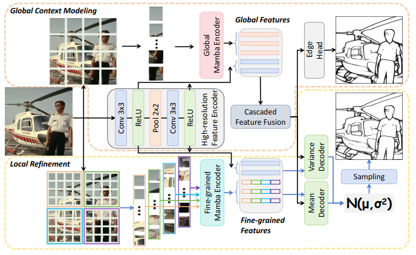
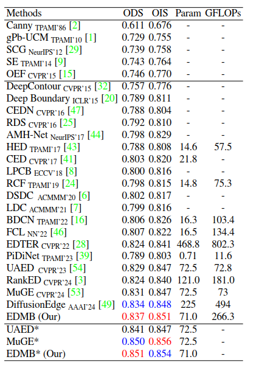
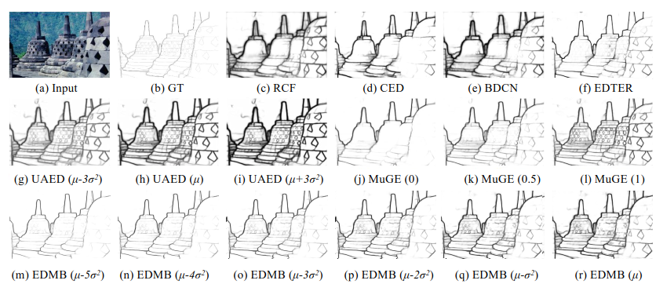

# EDMB: Edge Detector with Mamba

Transformer-based models have made significant progress in edge detection, but their high computational
cost is prohibitive. Recently, vision Mamba have shown excellent ability in efficiently capturing long-range depen-
dencies. Drawing inspiration from this, we propose a novel edge detector with Mamba, termed EDMB, to efficiently
generate high-quality multi-granularity edges. In EDMB, Mamba is combined with a global-local architecture,
therefore it can focus on both global information and fine-grained cues. The fine-grained cues play a crucial
role in edge detection, but are usually ignored by ordinary Mamba. We design a novel decoder to construct learnable
Gaussian distributions by fusing global features and fine-grained features. And the multi-grained edges are
generated by sampling from the distributions. In order to make multi-granularity edges applicable to single-label
data, we introduce Evidence Lower Bound loss to supervise the learning of the distributions. On the multi-label dataset
BSDS500, our proposed EDMB achieves competitive single-granularity ODS 0.837 and multi-granularity ODS
0.851 without multi-scale test or extra PASCAL-VOC data. Remarkably, EDMB can be extended to single-label
datasets such as NYUDv2 and BIPED. The source code is available at https://github.com/Li-yachuan/EDMB.



*Fig. 1 The EDMB’s framework. N(µ, σ2) means learnable Gaussian distributions, where the means µ and variances σ2 are predicted by the mean decoder and variance decoder, respectively.*



*Table 1 Quantitative results on the BSDS500 dataset. All edges are generated without multi-scale testing or additional PASCAL-VOC data. * means generating multi-granularity edges. The best two results are denoted as red and blue respectively, and the same for other tables.*



*Fig. 2 Qualitative comparisons on challenging samples in the BSDS500 test set. MuGE produces diverse results with edge granularity of 0, 0.5, and 1, respectively. EDMB and UAED samples from the learned distribution with µ + γσ2*

For more details, see [the paper](https://arxiv.org/pdf/2501.04846)

##Getting Started
###Step 1: Clone the EDMB repository:
```angular2
git clone https://github.com/Li-yachuan/EDMB.git
cd EDMB
```
###Step 2: Environment Setup:
```angular2
conda create -n edmb
conda activate edmb
```

```angular2
pip install -r requirements.txt
```

#### Install Dependencies for vmamba
```
wget https://github.com/Dao-AILab/causal-conv1d/archive/refs/tags/v1.1.1.zip
unzip v1.1.1.zip
cd causal-conv1d-1.1.1 && pip install .
wget https://github.com/state-spaces/mamba/archive/refs/tags/v1.1.1.zip
unzip v1.1.1.zip
cd mamba-1.1.1 && pip install .
wget https://github.com/MzeroMiko/VMamba/tree/main/kernels/selective_scan
cd kernels/selective_scan && pip install .
```
###Step 3: download data and pretrained-parameter
####dataset
- BSDS500: Following [UAED&MuGE](https://github.com/ZhouCX117/UAED_MuGE). For better visualization, we convert the images in mat format to jpg in advance. If you use images in mat format, you need to make a simple change in the data loading module. 

- NYUDv2:  Following [RCF](https://github.com/yun-liu/RCF).  

- BIPED: Following [DexiNed](https://github.com/xavysp/DexiNed). 
download them and point to the path in main.py(start from line 73)
#### download ckpt
[vmabma-s](https://github.com/MzeroMiko/VMamba/releases/download/%23v2cls/vssm_small_0229_ckpt_epoch_222.pth)
and put it to *./model/*
```
cd model && wget https://github.com/MzeroMiko/VMamba/releases/download/%23v2cls/vssm_small_0229_ckpt_epoch_222.pth
```

###Step 4: training model

#### stage I
```angular2
python main.py --batch_size 4 --stepsize 10-16 --maxepoch 20 --gpu 1 --encoder DUL-Mamba-s --savedir [save dir] --dataset BSDS-rand
```
#### stage II
python main.py --batch_size 3 --stepsize 10-14 --maxepoch 16 --gpu 2 --encoder MIXENC_PNG --decoder MIXUNET --savedir [save dir] --dataset BSDS-rand --global_ckpt [bset result of Stage I]

#### Generating multi-granu edge
```angular2
python main.py --batch_size 3 --stepsize 10-14 --maxepoch 16 --gpu 2 --encoder MIXENC_PNG --decoder MIXUNET --savedir [save dir] --dataset BSDS-rand --global_ckpt [bset result of Stage I] --mode test --resume [bset result of Stage II] -mg
```
#### Single-granu test
 We used Piotr's Structured Forest matlab toolbox available [here](https://github.com/pdollar/edges).
 
#### Multi-granu test
```angular2
python eval_muge_best/best_ods_ois_full.py [result dir]
```
For multi-granularity testing, refer to [MuGE](https://github.com/ZhouCX117/UAED_MuGE)

## Acknowledgments
[UAED](https://github.com/ZhouCX117/UAED_MuGE) 
[MuGE](https://github.com/ZhouCX117/UAED_MuGE)
[EDTER](https://github.com/MengyangPu/EDTER)
[VMAMBA](https://github.com/MzeroMiko/VMamba)

 


